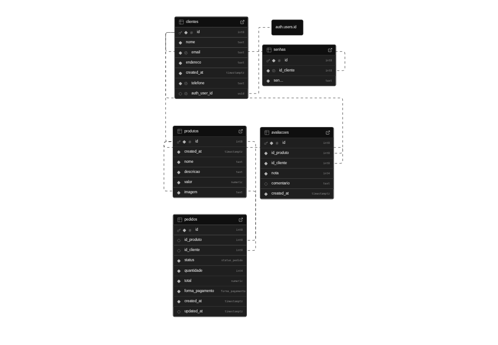

# Backend para e-commerce utilizando Supabase

Neste projeto foi desenvolvido um banco de dados para gerenciar informações de clientes, produtos e pedidos.

## Visualização do schema


Além das três tabelas solicitadas no teste eu criei mais duas que seriam para armazenar as senhas dos usuários para que essse dado não precise ser retornado sempre que a intenção seja apenas buscar informações sobre o perfil do cliente e outra para armazenar as avaliações dos produtos.

## Row-Level Security (RLS)
Para segurança em relação ao acesso e permissão de alterações de informações foram utilizadas politícas de segurança no banco de dados.
Há três tipos de níveis de restrição:
* Informações que todos podem acessar como a lista de produtos.
  
```
CREATE POLICY "Produtos são visíveis para todos"
ON public.produtos
FOR SELECT
TO anon, authenticated
USING ( true );
```
* Informações que utilizam o uth.uid() para verificar se a pessoa tem permissão como por exemplo apenas a própria pessoa pode ver suas informações de perfil.
```
CREATE POLICY "Select: apenas o próprio cliente pode ver seus dados"
ON public.clientes
FOR SELECT
TO authenticated
USING (auth_user_id = (SELECT auth.uid()));
```
* E restições que necessitam de um token utilizando o método auth.jwt() para garantir que apenas pessoas com essa autorização possam fazer determinadas modificações no banco.
```
  CREATE POLICY "Delete: apenas usuários autenticados com papel de admin podem deletar registros"
  ON public.clientes
  FOR DELETE
  TO authenticated
  USING ((auth.jwt() ->> 'role') = 'admin');
```
O código referente a criação das tabelas e das políticas de segurança foram divididos em arquivos separados referente a tabela em questão para facilitaar a visualização.

## Funções
Na pasta functions há duas funções uma que calcula o valor total do pedido e outra que altera o status do pedido

## Views 
Foi gerado uma view para retornar os pedidos que já contam como entregue.

## Edge Functions
Nesta parte de automação de tarefas eu não consegui desenvolver por completo, a função send-email que simula um envio de email está funcionando, já a que gera um csv não tive tempo de testá-la o suficiente para corrigi-la.
